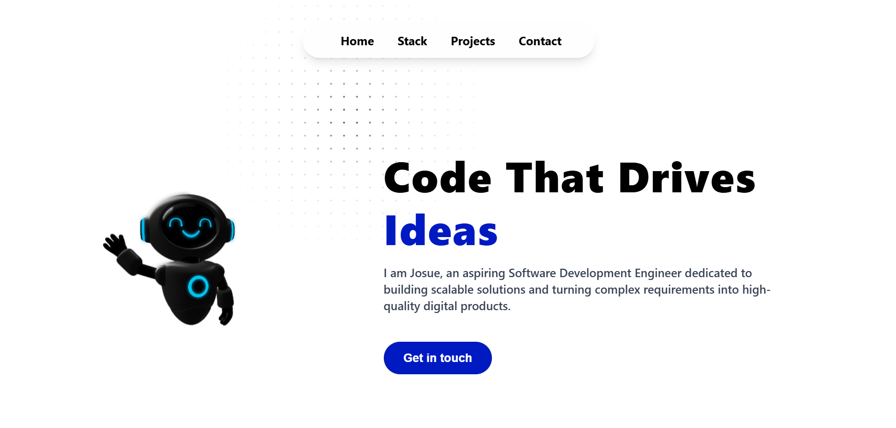
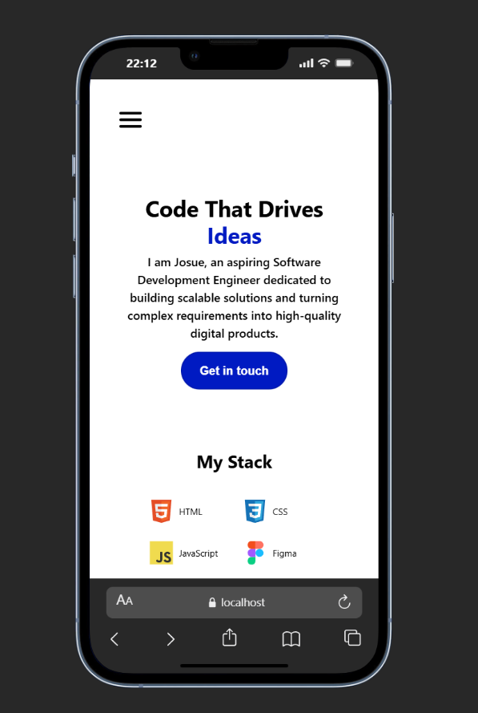

# 🚀 Modern 3D Portfolio | Josue Molina

Este portafolio es una vitrina de mis habilidades en Ingeniería de Software y Diseño UI/UX, combinando un rendimiento sólido con experiencias visuales inmersivas en 3D.

## 🌟 Lo más destacado
- **Interactividad 3D**: Integración de modelos Spline con control de cámara.
- **Visuales Orgánicos**: Implementación de `mask-image` y `backdrop-blur` para una interfaz moderna y limpia.
- **Arquitectura Escalable**: Configurado con Tailwind CSS v4 para una gestión de estilos ultra eficiente.
- **UX Optimizada**: Navegación fluida con scroll-smooth y menús interactivos.

## 🛠️ Tech Stack
| Frontend | Herramientas | 3D / Diseño |
| :--- | :--- | :--- |
| HTML5 / CSS3 | Git / GitHub | Spline 3D |
| JavaScript (ES6+) | NPM | Figma |
| Tailwind CSS v4 | VS Code | Adobe Suite |

## 📦 Instalación y Desarrollo
1. **Clonar:** `git clone https://github.com/Josudevp/tu-repositorio.git`
2. **Dependencias:** `npm install`
3. **Watch Mode:** `npm run dev`

## 📸 Galería de Vistas
### Desktop Experience

 
   

### Mobile First Design

 
   

---
Desarrollado con 💙 por Josue Molina.